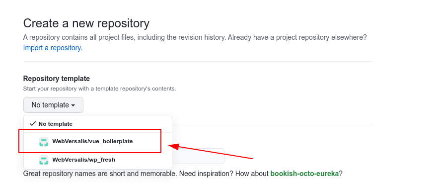

<p align="center">Copyright (c) 2021 webversalis</p><p align="center"><a href="https://vuejs.org" target="_blank"></a></p>  

<h1 align="center"><strong>Vue Boilerplate Template</strong></h1>  


<div align="center">  
  <strong>  
    🍒(vue  vite pinia vuex vue-router vue-i18n bootstrap) out of the box  
  </strong>  
</div>  

## Architecture

```text  
├─ public           // static assets.  
├─ src  
│  ├─ assets        // Les images (svg,png,...) et codes scss pour le design de la page  
│  ├─ service       // contient les classes typescript pour effectuer des requetes http  
│  ├─ components    // Vue components (header,footer,bouton ....)  
│  ├─ lang          // contient les fichiers de langue pour le i18n  
│  ├─ router        // la configuration de vue router  
│  ├─ store         // les stores (variable entre les pages)
│  ├─ utils         // repertoire pour les utilitaires │ 
│  └─ views         // les pages en format .vue  
├─ index.html       // page statique html de vite  
├─ vue.config.ts    // configuration de vite  
├─ tsconfig.json    // configuration de typescript
├─ package.json     // Liste des packages npm du projets
├─ babel.config.js  // configuration de babel
├─ .env.development // fichier de configuration des endpoints en developpement
├─ .env.production  // fichier de configuration des endpoints en production 
```  

## Liste des plugins
  <table>  
<tbody>  
 <tr>  
<td align="center" valign="middle">  
        <a href="https://vuejs.org/" target="_blank">  
            
        </a>  
      </td>  
       <td align="center" valign="middle">  
        <a href="https://git-scm.com/" target="_blank">  
            
        </a>  
      </td>
      <td align="center" valign="middle">  
        <a href="https://git-scm.com/" target="_blank">  
            
        </a>  
      </td>
        <td align="center" valign="middle">  
        <a href="https://pinia.esm.dev/" target="_blank">  
            
        </a>  
      </td>
       </td>
        <td align="center" valign="middle">  
        <a href="https://sass-lang.com" target="_blank">  
            
        </a>  
      </td>
        <td align="center" valign="middle">  
        <a href="https://element.eleme.io/#/" target="_blank">  
            
        </a>  
      </td>
 </tr>  
</tbody>  
</table>


## comment utiliser ce boilerplate ?

- Allez sur github , creer un nouveau depot tout en selectionnant le template comme sur l'image :  
  
- Ensuite cloner le projet dans votre repertoire de travail
- Lancer la  commande shell ci-dessous :

```shell  
npm install  
```  